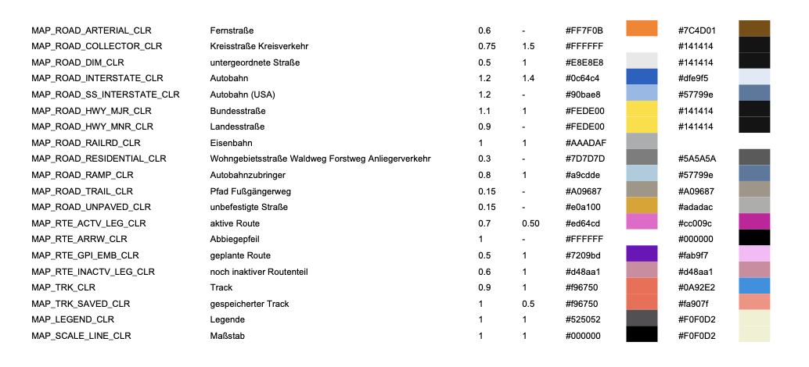

# garmin-theme-visualizer
Reading a garmin-theme (kmtf) and get a Excel and PDF File with python code




## Install

```plain
  git clone https://github.com/mgeode/garmin-theme-visualizer.git
  python3 -m pip install -r requirements.txt
```

## Usage

```plain
usage: garmin-theme-visualizer.py [-h] [-i INPUT_FILE] [-o OUTPUT_DIR]

options:
  -h, --help            show this help message and exit
  -i INPUT_FILE, --input-file INPUT_FILE
                        Input theme file
  -o OUTPUT_DIR, --output-dir OUTPUT_DIR
                        Outputdir
```
